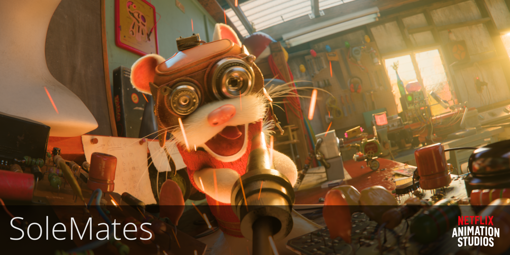
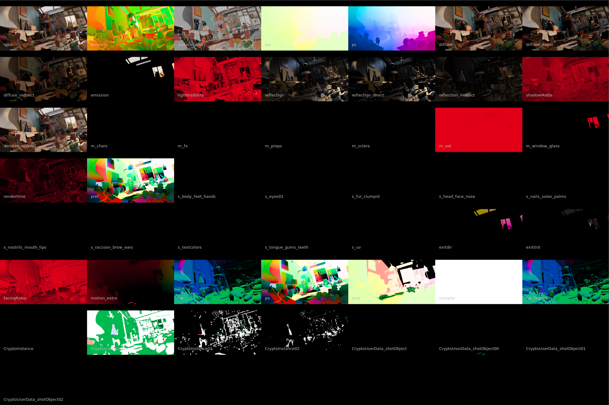
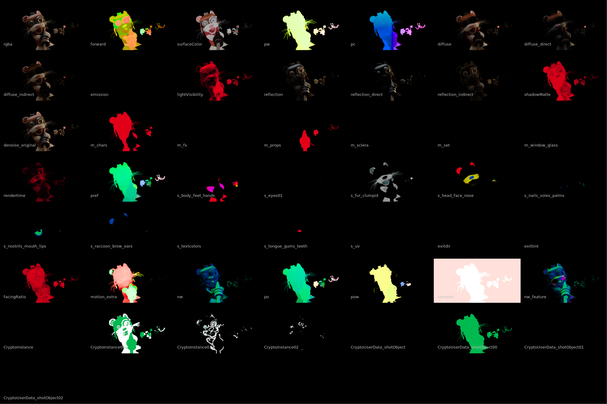
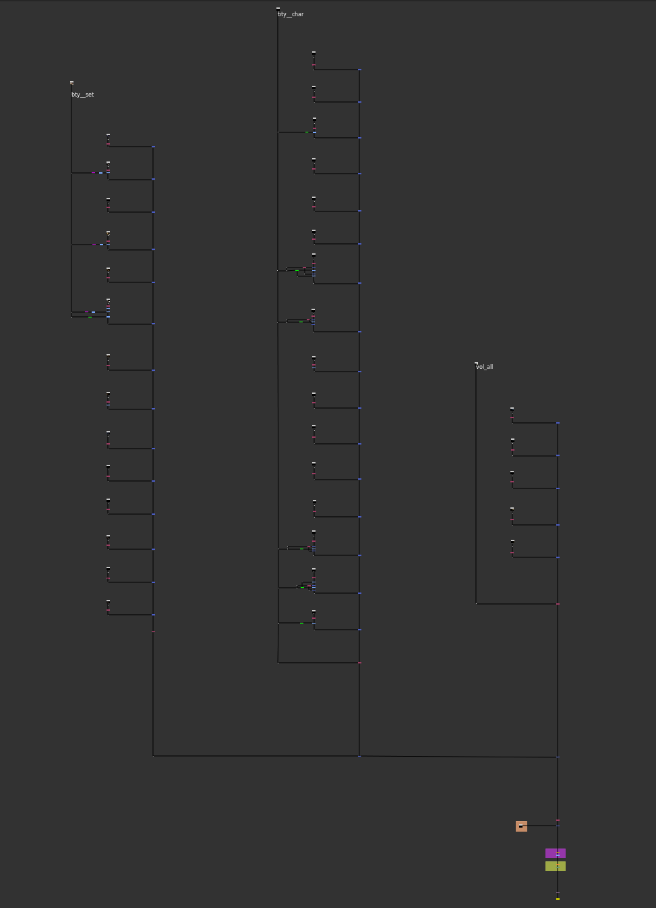
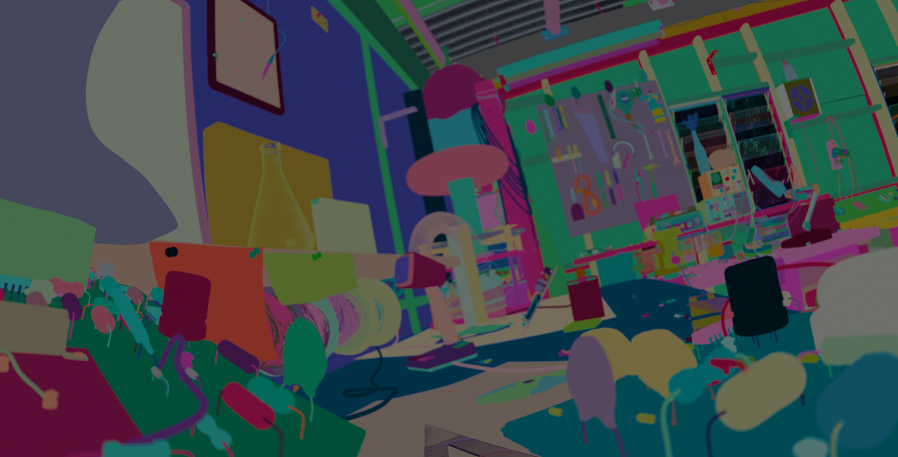
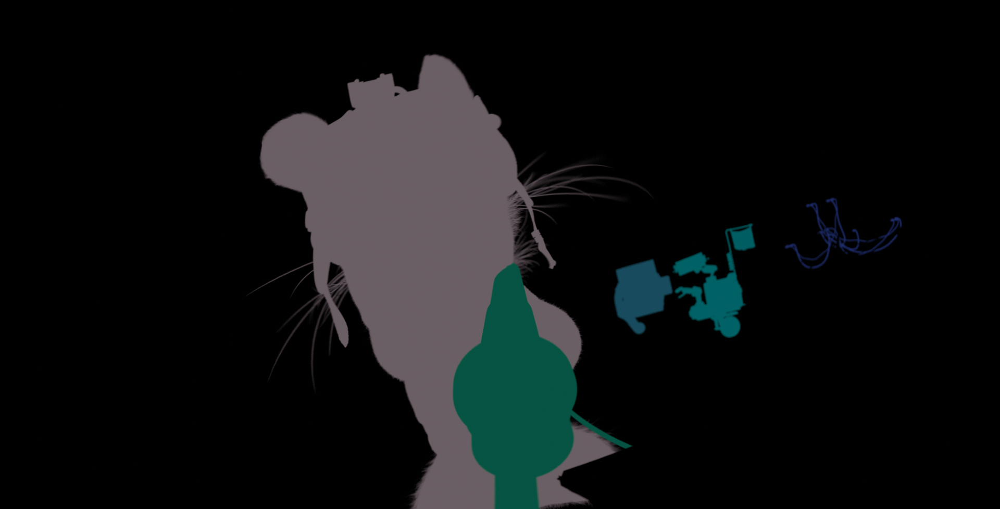

# Introduction

Welcome to the Sole Mates HDR Production Example from Netflix Animation Studios. An all-in-one compositing package bundled with a nukescript, high dynamic range render layers and media.

> [!IMPORTANT]
> This repository uses Git LFS. See the [Git Large File Storage](#git-large-file-storage) section below for details.

**TL;DR:** 
Download the package and open the [nuke script](<nuke_script>) to get started. Use Nuke 14 or higher to open the Nuke script. Check out the [Lighting Render Layers](<lighting_render_layers>) and cryptomatte manifests.

To view the final output, use the [EXR sequences](<exr_sequences>) or watch the provided [SDR](<media>) and [HDR](<media>) videos.

# About Sole Mates HDR Package

Sole Mates is a production example package, utilizing the [ALab](https://dpel.aswf.io/alab/) USD Production Scene. 

We are providing a comprehensive compositing package from Soul Mates. This package includes Lighting Render Layers, Nuke Script, EXR sequences, and both SDR and HDR videos. 

These assets make use of ACES 2.0 and are intended for viewing in HDR, as this example was entirely lit and rendered while viewed in an HDR environment from the initial lighting stages.

This shot is **61 frames long** and includes **42 different render layers**, covering the environment, characters, and volume renders. Beauty render layers also include cryptomattes and associated manifests.

The EXR sequences and both SDR and HDR videos are self-contained exports, available for direct viewing and use.

If you’re interested in taking a look at the compositing script, simply open the Nuke script to get started. The nuke script is already set up with relative paths, so as long as you maintain the folder structure, it will automatically load all the lighting renders for you. For more details, read the Nuke Script setup.

### Git Large File Storage

Due to space limitations, this GitHub repository includes only a single frame from the full sequence. If you would like access to the complete package containing all frames (approximately 104GB), it is available for download [here](https://dpel.aswf.io/solemates/)

This package contains files larger than 100MB, managed with [Git LFS](https://git-lfs.github.com/).

Please install Git LFS before cloning:

```bash
git lfs install
git clone git@github.com:DigitalProductionExampleLibrary/SoleMates.git
```

Without Git LFS, you cannot clone the repository with all large files. However, downloading the ZIP file from the website will work.

# Available Assets

As mentioned in the introduction, this comprehensive package includes multiple assets, each of which is explained below.

## Multi Pass Render Layers

This package includes **42 EXR render layers**, each produced with our internal [Glimpse](https://dl.acm.org/doi/10.1145/3084363.3085090) renderer. Every EXR file contains multiple channels and passes, totaling approximately **105 GB**. These files are the largest and most data-intensive assets in this collection, ideal for stress testing image processing and compositing workflows.

The primary beauty layers of the set and char contain 40+ different render passes. These include surface passes, data passes, and various mattes.

Beauty Set Render Passes             |  Beauty Char Render Passes  
:-------------------------:|:-------------------------:
  |  

Some of the key passes in this layer are:

- **rgba**: The main beauty pass, containing the standard Red, Green, Blue, and Alpha channels. This represents the master image.
- **diffuse**: Contains the diffuse lighting information.
- **reflection**: Contains the reflection information from a scene.
- **emission**: Captures self-illuminating elements, such as lights or glowing objects, for flexible adjustments.
- **position**: Contains world-space position data for each pixel, which is helpful for 3D relighting, re-projection, or integrating new elements.
- **normals**: Contains data representing the orientation of each surface in a scene, encoded as color values.
- **motion**: Contains motion vector in NDC (Normalized Device Coordinates) space.
- **CryptoChannels**: Cryptomatte data, allowing you to easily select and isolate specific objects or instances in compositing software.
- **denoise_original**: The original, un-denoised beauty pass, useful for comparison or for applying custom denoising processes.
- **rendertime**: Shows the wall clock render time in seconds for each tile, useful for diagnosing performance issues.
- **lightVisibility**: Represents the proportion of the light visible to the surface. Good for capturing shadows and backfacing surfaces.
- **sampler**: Adaptive sampler data: ray counts (camera, occlusion (shadow), indirect, probe).
- **facingRatio**: Facing ratio of the camera ray and the surface normal.
- **m_ render passes**: Mattes from lighting, based on scene elements like characters or props.
- **s_ render passes**: Mattes from surfacing, based on materials or painted features via shaders.


## Nuke Script

The included Nuke script combines all the render layers, composites them, and produces the EXR Sequences. Each of the render towers contain both the main render pass as well as the separated light groups.

This was created in **Nuke 14.1**, so we recommend using the same version or higher for the best compatibility.

Once you open the Nuke script, there are a few important steps to follow to ensure everything shows correctly:

### Relative Path Setup

All read nodes in the script use relative paths. This means the Nuke script must remain in its original location within the package. If you move the script, you’ll need to update the Read node paths or adjust the project directory in the Project Settings (Root Node).

### Color Management Setup

The Sole Mates production example uses **ACES-2.0** for color management and is required to accurately match the final EXR output. If matching the output is not necessary, configuring Nuke with OCIO and ACES v1.3 will provide a sufficient way to work within the script. This is also the configuration in which the script is supplied for maximum compatibility.

For Nuke versions compliant with VFX Reference Platform 2025 and above, ACES 2.0 will be available as an option in the Project Settings under the Color Tab and should be selected over ACES v1.3.

### Node Graph / Workflow


The Nuke script presents a complete node setup, structured into three main sections: **environment**, **characters**, and **volume render**.

As you explore the graph, you’ll see a few group nodes. These were internal toolsets or gizmos used to achieve the final look of the shot. Due to the limitations of the contribution, only simplified versions of these toolsets are included, featuring the specific nodes used in this script.

**Included Toolsets:**
- **PositionMatte:** Generates masks from the position world pass, allowing for grading or adjusting specific areas of the image.
- **MegaSaturation:** Adjusts the overall saturation of the shot using the HSV Color model.
- **FinalGlow:** Adds a glow effect to enhance the overall look.
- **ChromaticAberration:** Introduces chromatic aberration to mimic real lens fringing.

### Sparks Nuke Script

In this shot, we needed to add sparks to the character’s soldering action. To achieve this, we generated the sparks using NukeX’s particle system and rendered them as an [image sequence](particle_elements/sparks_render).


Since the sparks have already been rendered, you do not need NukeX. However, if you wish to render the particles yourself, we have provided the particle setup. Please ensure the script is opened with NukeX if you intend to adjust the particles.

For color space, use the same color management setup as described for the main nuke script.

> Note: The shot camera is provided in sparks setup in a Nuke Camera node. Use it if you want to create points from the position pass or for projection setups.

### Write

To render the EXR sequence from the Nuke script, you will find the Write node at the end of the node tree. The necessary settings have already been configured. The EXR sequence is set to render in **ACES2065-1** color space, with **16-bit half precision** and **Zip compression (16 scanlines)**.

## EXR Sequences


The [EXR sequences](<exr_sequences>) is the final output, rendered directly from the Nuke script. This sequence is saved in the OpenEXR format with **16-bit float precision** and includes only RGB channels. The resolution is **2048 x 1024**, and Zip compression (16 scanlines) is used. The EXR sequence is in the **ACES2065-1 (AP0)** color space.


## Colour Management

Sole Mates was created using the **ACES 2.0 Rendering Transform**, which is required for accurate display of EXR files with the intended creative look.

All provided Render Layers EXR Sequences are in **ACEScg (AP1)** colorspace. Only the output EXR sequences are **ACES2065-1 (AP0)**.

When working with these files, please ensure your application is set to use **ACES 2.0** for color management whenever possible.

If your application does not include ACES 2.0 by default but supports the OpenColorIO library (version 2.4.2 or higher), you can download and use the official ACES 2.0 configuration from the ASWF's [OpenColorIO-Config-ACES](https://github.com/AcademySoftwareFoundation/OpenColorIO-Config-ACES/releases/tag/v3.0.0) GitHub Repo.

You may use ACES 1.3 or other color management as an alternative, but please note that color accuracy and creative intent will differ from the intended result.

## QuickTimes

This package comes with **SDR and HDR media outputs**. These are created from the EXR sequences.

### SDR

- **Filename:** [NAS_Soul_Mates_21_2k_100nits_Rec709_ACES2_ProRes422HQ.mov](<media>)
- **Baked with:** ACES 2.0 Output Transform - Rec.709 BT.1886

**Specs:**
- Codec: Apple ProRes 422 HQ
- Bit depth: 10-bit fixed
- Color Primaries: Rec709
- Transfer Function: BT.1886
- Luminance Target: 100 nits

### HDR

- **Filename:** [NAS_Soul_Mates_21_2k_1000nits_Rec2020_ACES2_ProRes4444XQ.mov](<media/>)
- **Baked with:** ACES 2.0 Output Transform - Rec.2100 ST2084 (1000 nit P3-D65 Limited)

> As this media uses the Rec.2020 YUV coefficients, some media players may not accurately display the media as they do not correctly interpret the coefficients. Please keep this in mind.

**Specs:**
- Codec: Apple ProRes 4444 XQ
- Bit depth: 12-bit fixed
- Color Primaries: Rec2020
- Transfer Function: SMPTE ST 2084 (PQ)
- Luminance Target: 1000 nits
- SMPTE ST 2086 Mastering Metadata
    - Mastering Display Color Primaries: Display P3
    - Mastering Display Luminance: min: 0.0001 cd/m2, max: 1000 cd/m2


## CryptoMatte & Manifests

[Cryptomatte](https://github.com/Psyop/Cryptomatte) is a powerful tool for masking and isolating individual objects within rendered images. In this package, the main beauty layers `bty_set` and `bty_char` include Cryptomatte channels. 

CryptoMatte Beauty Set     |  CryptoMatte Beauty Char
:-------------------------:|:-------------------------:
  |  

There are two main types of Cryptomatte channels provided:

- **CryptoInstance:** Allows you to select or mask individual objects in the scene.
    - 

- **CryptoUserData_shotObject:** Shows only the main object(s) present in the shot, such as the set piece.
    - 

### Manifest Files

A Cryptomatte manifest is a JSON dictionary that maps human-readable object names to unique ID hashes for each object or material in the scene. We provide manifest files for all three beauty layers, with the most detailed information in `bty_char` and `bty_set`.

Within the `unh0400_0010_render_lighting_bty__char_layer_frames_v006` folder, you’ll find three manifest files:

- [unh0400_0010_render_lighting_bty__char_layer_frames_v006.instancemanifest](<lighting_render_layers/unh0400_0010_render_lighting_bty__char_layer_frames_v006/unh0400_0010_render_lighting_bty__char_layer_frames_v006.instancemanifest>)
- [unh0400_0010_render_lighting_bty__char_layer_frames_v006.shotobjectmanifest](<lighting_render_layers/unh0400_0010_render_lighting_bty__char_layer_frames_v006/unh0400_0010_render_lighting_bty__char_layer_frames_v006.shotobjectmanifest>)
- [unh0400_0010_render_lighting_bty__char_layer_frames_v006.shapemanifest](<lighting_render_layers/unh0400_0010_render_lighting_bty__char_layer_frames_v006/unh0400_0010_render_lighting_bty__char_layer_frames_v006.shapemanifest>)

These files contain the IDs and names (USD prim full paths) for each object. When you select a color in the Cryptomatte node, you will see the object’s name instead of just a number. For example:

```json
{"/usdSceneRoot/root/soldering_iron01/GEO/soldeingIron_M_hrc/stencilPowerCable_M_hrc/wire01_M_geo": "c0161d4c"}
```

The manifest paths are included as relative paths in the EXR metadata. This means that if the manifests are in the same directory as the EXR files, they will be loaded automatically; there is no need to manually select sidecar files.

**Example of a manifest path in EXR metadata:**
```plaintext
exr/cryptomatte/ed600b8/manif_file: ./unh0400_0010_render_lighting_bty__set_layer_frames_v005.instancemanifest
```

> **Note:** While manifests are optional, they make it much easier to identify objects by name instead of by number when picking mattes. Without the manifest, you can still select mattes, but you will only see the hash numbers rather than their names.

### Using CryptoMattes in Nuke

In this example, the Nuke script uses Cryptomatte to isolate objects for color adjustments. The beauty layer comes with embedded Cryptomatte channels and manifest paths, so when you load the render layer into Nuke, you can use the Cryptomatte node to pick mattes.

However, please note that our manifest files currently do not work directly with Nuke’s native Cryptomatte node. If you set it to sidecar metadata, an “invalid path” error will be shown. We implemented our own hashing method in the renderer (Glimpse) to avoid hash collisions. Nuke needlessly validates each path-hash pair by recalculating the hash from the path and discarding any path-hash pairs that don't match the standard mm3 hashing (see linked bug below). You can still pick mattes using the embedded metadata, but you will not see object names, only the mattes themselves.

**Cryptomatte Bug Ticket:** [ID 551242 - An error occurs if a Cryptomatte node's sidecar manifest is empty or contains custom hashes](https://support.foundry.com/hc/en-us/articles/13164664238738-ID-551242-An-error-occurs-if-a-Cryptomatte-node-s-sidecar-manifest-is-empty-or-contains-custom-hashes)
